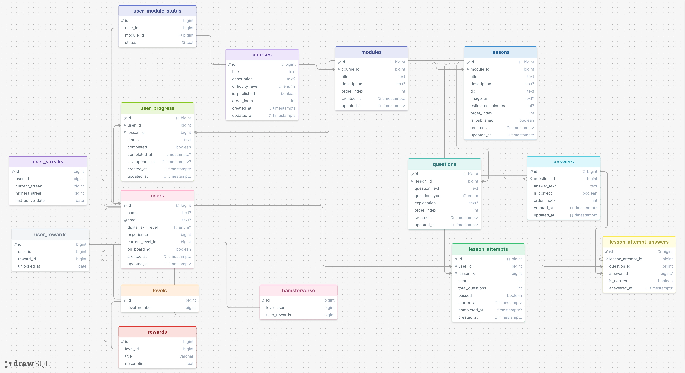

PIP Backend API
Introduction

PIP (Personal Internet Proficiency) is a gamified learning platform designed to help users improve their digital skills through interactive courses, lessons, quizzes, progression tracking, rewards, and experience-based leveling.

The backend provides a REST API responsible for:

User authentication and authorization
Course, module, lesson, and question management
User progression tracking
XP and leveling systems
Reward unlocking
Dashboard statistics
Hamsterverse gamification features

The application is built using Node.js, Express.js, SQLite, JWT authentication, and bcrypt password hashing.

Team
Eline van Straten
Ishika Soebhag
Charge Sadal
Quinzel Pires Monteiro
Airissa Vermond
Repository

GitHub Repository:

https://github.com/charge85172/PIP-API.git
Tech Stack
Backend
Node.js v24.14.0
Express.js
SQLite3
JWT Authentication
bcrypt
ES Modules
Infrastructure
Ubuntu VPS (Hogeschool Rotterdam)
DuckDNS
npm
Production Environment

Public API URL:

https://pip-api.duckdns.org

Server Address:

http://145.24.223.106:8000
Features
Authentication
User registration
User login
JWT token generation
Password hashing with bcrypt
Protected route support
Courses
Course overview
Individual course details
Course modules
Module lessons
Quiz questions and answers
Progression System
Start lesson attempts
Submit quiz answers
Automatic scoring
Lesson completion tracking
Module completion tracking
Course completion tracking
XP & Level System
Earn XP through activities
Automatic level calculation
Duplicate XP prevention
Reward unlocking on level-up
Dashboard
User statistics
Progress overview
Completed lessons
Streak information
Hamsterverse
Gamification system
Reward collection
XP progression
Level-based unlockables
Project Structure
PIP-API/
│
├── controllers/
│   ├── authController.js
│   ├── courseController.js
│   ├── dashboardController.js
│   ├── hamsterverseController.js
│   ├── lessonController.js
│   ├── moduleController.js
│   ├── progressController.js
│   ├── questionController.js
│   ├── userProgressionController.js
│   └── xpController.js
│
├── routes/
│   ├── authRoutes.js
│   ├── courseRoutes.js
│   ├── dashboardRoutes.js
│   ├── hamsterverseRoutes.js
│   ├── progressRoutes.js
│   ├── rewardRoutes.js
│   └── userRoutes.js
│
├── middleware/
│   └── auth.js
│
├── Database/
│   └── pip.sqlite
│
├── db.js
├── index.js
└── README.md
Entity Relationship Diagram (ERD)

The database structure is shown below.

Add your ERD image to the repository and update the path if necessary.

Core Relationships
Users
│
├── User Progress
│    └── Lessons
│         └── Modules
│              └── Courses
│
├── Lesson Attempts
│    └── Lesson Attempt Answers
│
├── XP Transactions
│
├── User Rewards
│    └── Rewards
│
└── User Streaks

Courses
└── Modules
└── Lessons
└── Questions
└── Answers
Installation Instructions
Prerequisites

Install:

Node.js v24.14.0
npm

Verify installation:

node -v
npm -v
Clone Repository
git clone https://github.com/charge85172/PIP-API.git

cd PIP-API
Install Dependencies
npm install
Environment Variables

Create a .env file in the project root:

EXPRESS_PORT=8000

JWT_SECRET=your_secret_key

JWT_EXPIRES_IN=1y

NODE_ENV=development
Database Setup

The project uses a SQLite database.

Database location:

Database/pip.sqlite

The repository includes a database file.

Before starting the application:

Ensure the SQLite database exists.
Run the seed script.
Verify that all required tables have been created.
Database Migrations

This project currently does not use a migration system.

A migration system allows database changes to be version controlled and automatically applied across environments. Because this project uses a shared SQLite database for educational purposes, migrations were not required.

Start Application
Development
npm run dev
Production
npm start

Server will run on:

http://localhost:8000
Deployment Instructions
Production Server

The application is deployed on an Ubuntu VPS provided by Hogeschool Rotterdam.

Production URL:

https://pip-api.duckdns.org
Deployment Steps
1. Connect to VPS
   ssh username@server-ip
2. Clone Repository
   git clone https://github.com/charge85172/PIP-API.git
3. Install Dependencies
   npm install
4. Configure Environment Variables

Create:

.env

with:

EXPRESS_PORT=8000
JWT_SECRET=your_secret_key
JWT_EXPIRES_IN=1y
NODE_ENV=production
5. Verify Database

Ensure:

Database/pip.sqlite

exists and contains seeded data.

6. Start Application
   npm start
7. Verify Deployment

Open:

https://pip-api.duckdns.org/health

Expected response:

{
"status": "OK",
"timestamp": "2026-06-11T12:00:00.000Z",
"message": "PIP Backend is running"
}
API Endpoints
Authentication
Register User
POST /api/register

Body:

{
"name": "John Doe",
"email": "john@example.com",
"password": "password123"
}
Login User
POST /api/login

Body:

{
"email": "john@example.com",
"password": "password123"
}
Users
Get All Users
GET /api/users
Get User
GET /api/users/:id
Get Onboarding Status
GET /api/users/:id/onboarding-status
Get User Progress
GET /api/users/:id/progress
Courses
Get All Courses
GET /api/courses
Get Course
GET /api/courses/:courseId
Get Modules
GET /api/courses/:courseId/modules
Get Module
GET /api/courses/:courseId/modules/:moduleId
Get Lessons
GET /api/courses/:courseId/modules/:moduleId/lessons
Get Lesson
GET /api/courses/:courseId/modules/:moduleId/lessons/:lessonId
Get Questions
GET /api/courses/:courseId/modules/:moduleId/lessons/:lessonId/questions
Get Question
GET /api/courses/:courseId/modules/:moduleId/lessons/:lessonId/questions/:questionId
Progress
Start Lesson Attempt
POST /api/progress/lessons/:lessonId/start

Body:

{
"userId": 1
}
Submit Answer
POST /api/progress/attempts/:attemptId/answers

Body:

{
"questionId": 1,
"answerId": 2
}
Complete Attempt
POST /api/progress/attempts/:attemptId/complete
Get Attempts
GET /api/progress/lessons/:lessonId/attempts/:userId
XP System
Award XP
POST /api/progress/xp

Body:

{
"userId": 1,
"activityType": "question_answer",
"activityId": 10
}
Dashboard
Get Dashboard
GET /api/dashboard/:userId
Hamsterverse
Get Hamsterverse Data
GET /api/hamsterverse/:userId
Edge Cases & Error Handling
Authentication
Missing Token
{
"success": false,
"message": "Missing token"
}

Response:

401 Unauthorized
Invalid Token
401 Unauthorized
Duplicate Email Registration
409 Conflict
Invalid Login Credentials
401 Unauthorized
Course System
Course Not Found
404 Not Found
Module Not Found
404 Not Found
Lesson Not Found
404 Not Found
Question Not Found
404 Not Found
Quiz System
Duplicate Question Submission

A user cannot answer the same question twice within a single lesson attempt.

Response:

409 Conflict
Invalid Answer Selection

Response:

404 Not Found
Empty Attempt

Completing an attempt without answers results in:

{
"score": 0
}
XP System
Duplicate XP Awards

XP rewards are protected through a database UNIQUE constraint.

This prevents users from earning XP multiple times for the same activity.

Response:

409 Conflict
Missing Request Fields

Response:

400 Bad Request
Database Errors

Unexpected database failures return:

500 Internal Server Error
Unknown Routes

Unknown endpoints return:

404 Not Found
Security

The application currently includes:

JWT authentication
Password hashing with bcrypt
Protected user routes
Input validation
Duplicate XP protection
Database constraints

Future improvements:

Refresh tokens
Role-Based Access Control (RBAC)
Rate limiting
Security logging
OWASP Top 10 hardening
Future Improvements
Refresh Tokens
Role-Based Access Control (RBAC)
Swagger/OpenAPI Documentation
Unit Testing
Integration Testing
Docker Deployment
CI/CD Pipeline
Rate Limiting
Caching
Email Verification
Password Reset Functionality
Migration System
PostgreSQL Support
Health Check

Endpoint:

GET /health

Response:

{
"status": "OK",
"timestamp": "2026-06-11T12:00:00.000Z",
"message": "PIP Backend is running"
}

License

This project was developed as part of the CMGT TLE4 Startup project at Hogeschool Rotterdam.

Version
Version: 1.0.0

Authors
Eline van Straten
Ishika Soebhag
Charge Sadal
Quinzel Pires Monteiro
Airissa Vermond